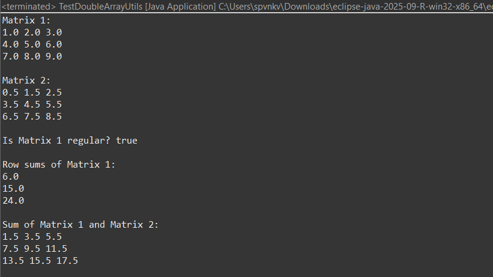

# Exercise 4: Double Array Utilities



## Description
This exercise provides utility methods for working with 2D arrays (matrices) of double values.

## What it does
The program implements several utility methods for matrix operations:

### Methods
1. **affiche(double[][] t)**: Displays a 2D array in a formatted way
2. **regulier(double[][] t)**: Checks if a matrix is regular (all rows have the same length)
3. **sommeLignes(double[][] t)**: Calculates the sum of each row
4. **somme(double[][] t1, double[][] t2)**: Adds two matrices element-wise

## Files
- `DoubleArrayUtils.java`: Contains the utility methods for matrix operations
- `TestDoubleArrayUtils.java`: Test program that demonstrates all utility methods

## Example Output
```
Matrix 1:
1.0 2.0 3.0
4.0 5.0 6.0
7.0 8.0 9.0

Matrix 2:
0.5 1.5 2.5
3.5 4.5 5.5
6.5 7.5 8.5

Is Matrix 1 regular? true

Row sums of Matrix 1:
6.0
15.0
24.0

Sum of Matrix 1 and Matrix 2:
1.5 3.5 5.5
7.5 9.5 11.5
13.5 15.5 17.5
```
