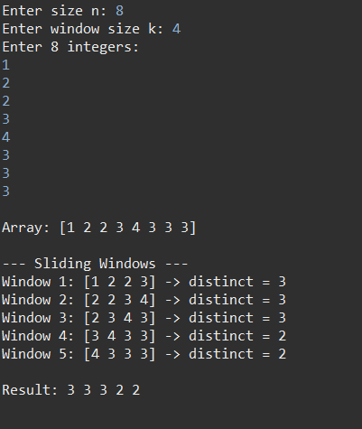

# Exercise 6: Sliding Window - Distinct Values Count



## Objective
For an integer array T of size n and a window of size k, calculate for each window position the number of distinct elements within that window, using O(n) time complexity with loops and arrays only.

## Description
This exercise implements an efficient sliding window algorithm to count distinct elements in each consecutive window of size k. The solution uses only basic data structures (loops and arrays) without using Set or Map collections.

## Constraints
- 1 d k d n d 100,000
- Array values are bounded in [0..100,000] (allows using a frequency array)
- Only loops and arrays are allowed (no Set/Map)

## Algorithm
1. Read n (array size), k (window size), and n integers into array T
2. Create a frequency array `freq` of size MAXV+1 (MAXV = 100,000) initialized to 0
3. Initialize the first window [0..k-1]:
   - For each element x in the window: increment freq[x]
   - Maintain a counter `distinct`: increment only when freq[x] goes from 0 to 1
4. Slide the window one position at a time for i from k to n-1:
   - Remove outgoing element: out = T[i-k]; decrement freq[out]; if freq[out] becomes 0, decrement distinct
   - Add incoming element: in = T[i]; increment freq[in]; if freq[in] becomes 1, increment distinct
   - Output the distinct count

## Complexity
- Time: O(n + MAXV) for initialization + traversal
- Space: O(MAXV) for the frequency array

## Example

**Input:**
```
8 4
1 2 2 3 2 1 4 2
```

**Windows (size 4):**
```
[1 2 2 3] � 3 distinct elements
[2 2 3 2] � 2 distinct elements
[2 3 2 1] � 3 distinct elements
[3 2 1 4] � 4 distinct elements
[2 1 4 2] � 3 distinct elements
```

**Output:**
```
3 2 3 4 3
```

## Test Cases
- All identical elements (constant answer = 1)
- All distinct elements (answer = k for windows)
- Small k (k=1) and large k (k=n)
- Values at boundaries: 0 and 100,000

## Files
- `Main.java`: Main program implementing the sliding window algorithm
- `image.png`: Visual diagram or reference image
